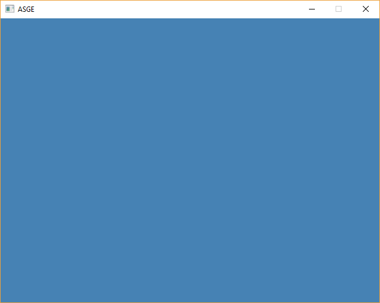
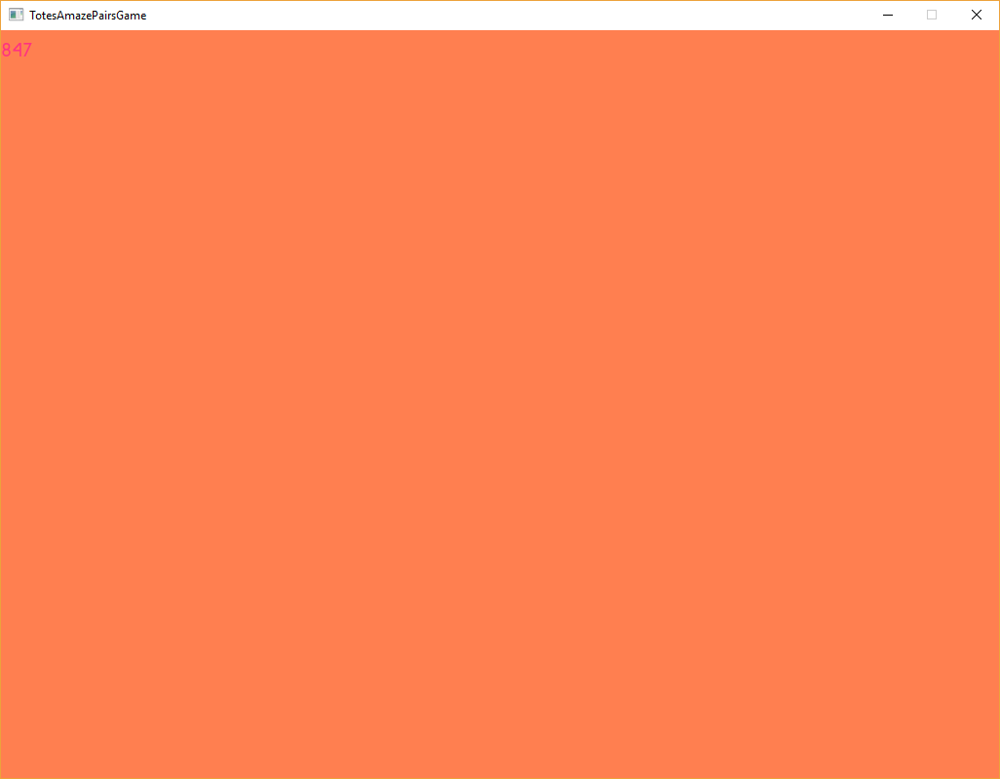
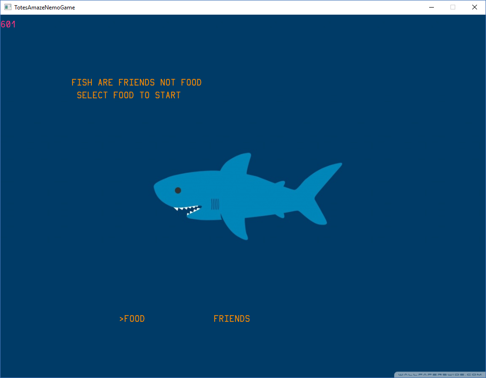
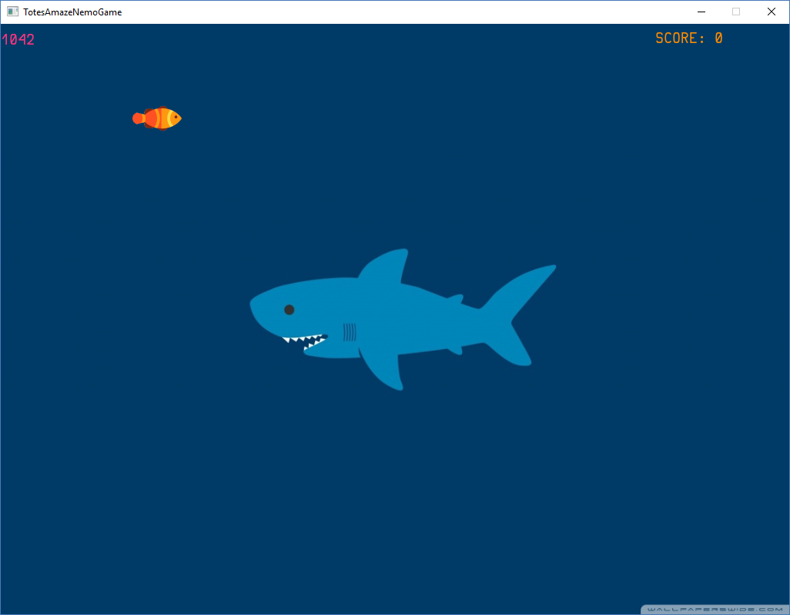
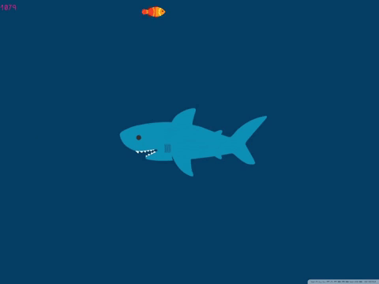
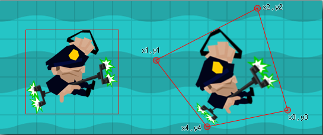
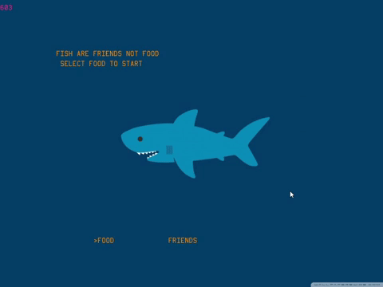

ASGE Tutorial:
==================
This week we will be getting our hands dirty and working with ASGE a rendering framework that's designed to allow rapid prototyping of games. The engine uses modern OpenGL and attempts to utilise as much platform independent code as possible. At this point, we'll be saying farewell to the console, so say your goodbyes and grab your hugs whilst you still can. 

By completing this tutorial you will learn the following:
- What the ASGE framework is
- How to create a game using the framework
- Creation and rendering of sprites
- The processing of objects 
- Callback handler functions and how to use them
- How to implement a basic version of a "whack-a-mole" game

**It is essential you complete this tutorial before attempting your assignment**

\
The Layout
------
The game follows a very strict folder layout. Ensure you follow it. 

**-> Docs:** API documentation. 

**-> Libs:** The render engine libraries.

**-> Projects:** The solution file and the Visual Studio Projects.

**-> Resources:** The resources for the game.

**-> Resources --> Fonts:** Any custom fonts that you might want to use.

**-> Resources --> Textures:** All the images for the sprites are stored here. 

**--> Source:** All the source code relating to the game goes here. 

\
The Dawn of Our Game
------
What better place to start a story then at the beginning? To aid with the creation of the game, a prebuilt solution has been provided on GitHub. In this solution the build targets and the library has already been linked, however, there is no game present just an empty main function. 

You can obtain the source code via the following link: https://cfds

Start by cloning the repository and opening the solution in visual studio 2017... You should find the project builds and a single source file "main.cpp" has been included. Before we can "run" our game we need to create it. 

There are two important game related files included

NemoGame.h \
NemoGame.cpp

One is a header and the other a source. If you were to build the game it now, it should compile, however, it will crash if you attempt to run it. Let's have a look at why.

\
Starting the Game API
------
The NemoGame class will be used to control the flow of the game and is responsible for communicating with the ASGE framework. For each game, there are three mandatory functions that must be implemented. It uses inheritance (part of OOP).

- **init** - intialises the game and the ASGE framework.
- **update** - simulates the game and the objects inside of it.
- **render** - draws the game objects to the screen.

**Don't worry if this doesn't all make sense, it's what's known as boilerplate code. Ensure your game is still building before continuing. If it's not ensure that the header file and source files are both in the source directory on the hard drive.**

\
Initialising the Game Class
------
Before the game can run we need to perform initialisation of the game. The first stage is to initialise the low-level graphics API. This is simple enough to do. Head on over to the PairsGame.cpp file you created. 

Inside the "PairGames::Init" function add the following if statement

~~~C++
// initialises the graphics API, check to make sure it was a success
if (!initAPI())
{
    return false;
}

// disable sprite batching for simplicity 
renderer->setSpriteMode(ASGE::SpriteSortMode::IMMEDIATE);
~~~

And inside the WinMain function
~~~C++
int WINAPI WinMain(
	HINSTANCE hInstance, 
	HINSTANCE hPrevInstance, 
	PSTR pScmdline, int iCmdshow)
{
    // create an instance of the game
    NemoGame game;
    if (game.init())
    {
        // if it initalised correctly run it
        return game.run();
    }

    // otherwise we error out
    return -1;
}
~~~

Compile your changes and attempt to launch the game, if everything has gone to plan an empty game window will be created. Empty doesn't mean awesome, just check out that classic cornflour blue colour :-)

\
Customising the Window
------
At this point the following tasks have been completed
- Added a new class describing the game
- Initialised the API
- Create a basic windowed game application

Next up is the customisation of the window.

\
**Game Width and Game Height:** When designing a game, the graphics and mapping of coordinates (in 2D games) is directly linked to a resolution. This is called the design resolution and this can be specified by adjusting two variables inside the game. They are named game_width and game_height. Change the resolution by specifying the width and height in the constructor

~~~C++
game_width = 1024;
game_height = 768;
~~~

\
**Window Title:** Adjust the name of the window to something more interesting. For example to change it from ASGE to TotesAmazeNemoGame the following code snippet can be used. 

~~~C++
renderer->setWindowTitle("TotesAmazeNemoGame");
~~~

\
**Clear Colour:** If for some strange reason the you can't handle the cornflour blue, the clear colour can be easily adjusted. 

~~~C++
renderer->setClearColour(ASGE::COLOURS::CORAL);
~~~

\
**FPS:** It is possible to toggle the FPS counter on and off. 

~~~C++
toggleFPS();
~~~

\
Complete the customisations. Running the game again should now how the updated window, with FPS counter, the custom title and new clear colour (if changed). 

\
Who's Feeling Spritely?
------
At this point the following tasks have been completed
- Added a new class describing the game
- Initialised the API
- Create a basic windowed game application
- Customised the resolution and window settings

Almost all 2D games require some sprites and this one's no exception. As we're going to be making a whack-a-mole game, a sprite is required to be whacked. Lucky for you, one has already been included with the source code (though feel free to find your own.)

Begin by adding a background sprite. There's already a variable called background assigned to the game class, so it makes sense to use it. Inside of the init function for the game (NemoGame.cpp) add the following code

~~~C++
// load the background sprite
background = renderer->createRawSprite();
background->loadTexture(".\\Resources\\Textures\\background.jpg");
background->width(1024);
background->height(768);
~~~

Firstly memory is allocated for the sprite. As ASGE supports different Renderers,we ask it directly to create the type of sprite we need. It is dynamically allocated so will also need freeing up. This is performed in the class destructor. The load texture function is the image to use for drawing the sprite. The width and the height allow customisation of the sprite's dimensions. 

\
Next up is the initialisation of the cute little Clownfish. 
- Start by creating the sprite using the renderer
- Then load the clown-fish-icon.jpg. 
- Set its width and height to 64 
- Flip it on the X axis to reverse its facing direction. 

~~~C++
// load the clownfish
clownfish = renderer->createRawSprite();
clownfish->loadTexture(".\\Resources\\Textures\\clown-fish-icon.png");
clownfish->width(64);
clownfish->height(64);
clownfish->setFlipFlags(ASGE::Sprite::FlipFlags::FLIP_X);
~~~

\
Rendering the Sprites
-----
Rendering a sprite is simple, pass the renderer a sprite and it will do the hard work for us. However, the renderer needs a reference to a sprite. If your sprite is stored as a pointer you will need to dereference it first (*).
~~~C++
// if not using a pointer
renderer->renderSprite(sprite);

// using a pointer
renderer->renderSprite(*sprite);
~~~

Before rendering the sprites, it is important to consider when they should be rendered. The game has two states already included in it, one for the menu and the other for the actual gameplay. The background should be shown in both states but we only want the Clownfish to show when the game is running. Inside the render function, render the background before the menu checks. As the render functions accept references to sprites and they are being stored as pointers, they first need to be dereferenced before the address of reference can take place. This is why the * is neusededed. 
~~~C++
void PairsGame::render(const ASGE::GameTime &us)
{
    // use the default game font
    renderer->setFont(0);
    
    // render the background sprite irrespective of game mode
    // to obtain a reference from a pointer, derefernce it first
    renderer->renderSprite(*background);

    // if in the main menu 
    if (in_menu)
    {
        // renders the welcome text
        renderer->renderText("FISH ARE FRIENDS NOT FOOD \n SELECT FOOD TO START", 
        150, 150, 1.0, ASGE::COLOURS::DARKORANGE);
    }
    
    // else we must be in game
    else
    {
        // render the clownfish
        // to obtain a reference from a pointer, dereference it first
        renderer->renderSprite(*clownfish);
    }	
}
~~~

\
May the Show Begin
------
At this point the following tasks have been completed
- Added a new class describing the game
- Initialised the API
- Create a basic windowed game application
- Customised the resolution and window setting
- Initialised and rendering of the background
- Initialised and rendering of the clownfish during gameplay

 Just like rendering of sprites, text rendering is a simplified process in ASGE. There's already a font provided by the Engine. A function named renderText can be used. It requires a c string and can be customised to accept positions, scale and colour.  
~~~C++
// the function signature
void renderText(const char* str, int x, int y, float scale, const Colour& colour)

// using the function is as simple as passing a string and position
renderer->renderText( "Hello World", 25, 50, 1.0f, ASGE::COLOURS::GREEN)
~~~

Before the game can start, there should be two options. One to play the game and one to exit the game. As the theme of the game is "Fish are friends not food", add two options as text to the main menu, one named food and on name friends.

Place this code inside the menu rendering code block.
~~~C++
renderer->renderText(menu_option == 0 ? ">FOOD" : "FOOD", 
250, 650, 1.0, ASGE::COLOURS::DARKORANGE);
        
renderer->renderText(menu_option == 1 ? ">FRIENDS" : "FRIENDS", 
450, 650, 1.0, ASGE::COLOURS::DARKORANGE);
~~~

This code will generate two options one named Food and the other Friends. They make use of the ternary (look it up) operator to place a ">" symbol in front of the selected option. Those with keen eyes will notice the use of a variable named menu_option. This is needed to tell the game which menu option is currently selected. It makes sense to drive this via the left and right arrows. In order to achieve that the key press event must be handled. 

In the game there's a function named keyHandler. This is called when  a key is pressed or released. This is interesting data as examining it means it's possible to detect when an arrow key has been pressed (an event will signal). A key event is a small data structure that stores the key and its associated data. 

~~~C++
struct KeyEvent : public EventData
{
    int key		= -1; /**< The key.    The key in question. */
    int scancode	= -1; /**< Scancode.   The unique scancode. */
    int action		= -1; /**< Key action. A key has been pressed or released. */
    int mods		= -1; /**< Modifiers.  Any modifiers applied i.e. ctrl, shift etc. */
};

// the different key actions possible
constexpr int KEY_RELEASED = 0; /**< Key Release. The key was pressed. */
constexpr int KEY_PRESSED  = 1; /**< Key Press. The key was released. */
constexpr int KEY_REPEATED = 2; /**< Key Repeat. The key was held down until it repeated. */
~~~

Edit the keyHandler function so that when the right key is pressed the menu option changes value. The two values needed are 0 and 1 \
0 representing food \
1 representing friend

**This is the information used by the ternary operator.**

~~~C++
void NemoGame::keyHandler(const ASGE::SharedEventData data)
{
    // converts the system event into a key one
    auto key = static_cast<const ASGE::KeyEvent*>(data.get());
    
    // checks to see if the right key was released
    if( key->key == ASGE::KEYS::KEY_RIGHT &&
        key->action == ASGE::KEYS::KEY_RELEASED)
    {
        // toggles between 1 and 0
        menu_option = 1 - menu_option;
    }
}
~~~

*Now **add** support for the LEFT KEY. Hint: ASGE::KEYS::KEY_LEFT*

At this point make sure the game compiles and you can move the options between friend and food. If everything has gone well you should be presented with the following menu screen. 

It's all well and good being able to select the menu options, but there's a "pressing" need for some processing to action them. A simple solution is to use the key event handler to listen for the enter key being released. Implement the following and complete the logic by setting the in menu boolean. 

~~~C++
if (key->key == ASGE::KEYS::KEY_ENTER && 
    key->action == ASGE::KEYS::KEY_RELEASED)
{
    if (menu_option == 1)
    {
        // exit the game
        signalExit();
    }

    else 
    {
        // set the in menu boolean to false
    }
}
~~~

\
Just Keep Swimming
------
At this point the following tasks have been completed
- Added a new class describing the game
- Initialised the API
- Create a basic windowed game application
- Customised the resolution and window setting
- Initialised and rendering of the background
- Initialised and rendering of the clownfish during gameplay
- The menu options have been rendered to the menu
- The Right and Left arrow keys can be used to select menu options
- The menu can now start the game or exit depending on the selection

Launching the game is great, but the game itself isn't. Nothing's happening. At this point, there's just the same old background and lifeless clown fish in the middle of the screen. The next stage is to get the fish swimming left to right. Eventually we'll need to catch it. 

\
The update and simulation of game objects should be handled from the Update function. This is automatically called every frame and is guaranteed to happen before rendering occurs. This means all objects can be properly simulated and then rendered to keep the game world consistent. Looking at the function signature, there's an interesting parameter being provided named GameTime
~~~C++
void NemoGame::update(const ASGE::GameTime& us)
~~~

Game time is important as it allows the movement of objects over time rather than on a frame-by-frame basis. For example: instead of moving a sprite 10 pixels every time a frame is updated, move it 10 pixels over a second. This means irrespective of how quickly a frame arrives the sprite still moves at 10 pixels a second. An in-depth deiscussion of this is outside of the scope of this tutorial, but there is plenty of documentation and literature available. 

Add the following code to the update function
~~~C++
// grab the current position
auto x_pos = clownfish->xPos();

// move the fish 500pixels/sec in the right direction
// delta time is measured in milliseconds, so divide by 1000 and multiply
x_pos += 500 * (us.delta_time.count() / 1000.f);

// update the position of the clown fish
clownfish->xPos(x_pos);
~~~

There's a problem with this implementation. Can you see it?
... 
What happens when the fish gets to the edge of the screen?

You will need to fix this by wrapping the fish back to the left of the screen. You can use the game_width to calculate the edge of the screen. Remember the far left of the screen is 0. When completed, the game should look and play as follows:

Frog Spawn
------
At present the foundations of our whack-a-mole game are in place. Before moving onto the hit detection part of the game, we should randomise the starting position of the fish as to make it more of a challenge. There is already a function named spawn inside the game. Generate a random x and y position and assign them to the clown fish. This can be accomplished in very few lines. This builds on the experience you've had with random number generation in the past.

~~~C++
void NemoGame::spawn()
{
    // randomnly generate x and y position
    // assign to the fish
}
~~~

Feeling Included
------
At this point the following tasks have been completed
- Added a new class describing the game
- Initialised the API
- Create a basic windowed game application
- Customised the resolution and window setting
- Initialised and rendering of the background
- Initialised and rendering of the clownfish during gameplay
- The menu options have been rendered to the menu
- The Right and Left arrow keys can be used to select menu options
- The menu can now start the game or exit depending on the selection
- The clown fish moves left to right and at a set speed over time
- The fish randomly spawns on the game start

We're almost there! Everything is in place, bar hit detection. It make sense for the player to attempt to "whack" the fish using the mouse cursor. In order for this to work you will need to perform some basic collision detection.

A function already exists in the game as a starting point. You will need to create a bounding box (this is very simple and google can help) surrounding the sprite and then use the mouse x and y coordinates to see if they reside within it. 

~~~C++
// function returns true if x and y reside within the sprite
bool PairsGame::isInside(const ASGE::Sprite* sprite, float x, float y) const
{

}
~~~

Once the collision code is implemented it can be easily tested by respawning the fish every time a click is made that is inside the bounding box of the sprite. Head over to the clickHandler function. Just like the keyHandler this is called automatically, everytime a click is registered in fact. Edit the body of the isInside check and add a spawn function call if the point is contained in the bounding box.

~~~C++
if (isInside(clownfish, x_pos, y_pos))
{
    spawn();
    score++;
}
~~~

Points Make Prizes
------
We're almost there! 

The last stage is to add some form of progression to the game. There's already a score variable in the game, it's even incrementing, we're just not displaying it on the screen. Remedy this by rendering the score as text inside the game's render function. There's a catch, however, as the score is an integer and we need a string in order to render. To resolve this, we can use the to_string function from the string class. Inside the render function add the following lines. 

~~~C++
// creates a string with the score appended
std::string score_str = "SCORE: " + std::to_string(score);

// renders the string. a std string is not a c string so needs to be converted hence .c_str()
renderer->renderText(score_str.c_str(), 850, 25, 1.0, ASGE::COLOURS::DARKORANGE);
~~~

Compile and run the game! If all goes well you'll have a fully functional (though simple) game. 

Improvements & Suggestions
------
Congratulations on making it this far.. But this is just the beginning. Consider implementing some of these additional features to make extend the game's playability. 

- Ensure fish spawn within the window
- Why not let the fish head in different directions?
- Implement random velocities for the clown fish
- Allow multiple fish on the screen at any one time 
- Add a timer to the HUD
    - How many in a minute
    - Create a high score table (persistant)
- **Just go crazy**